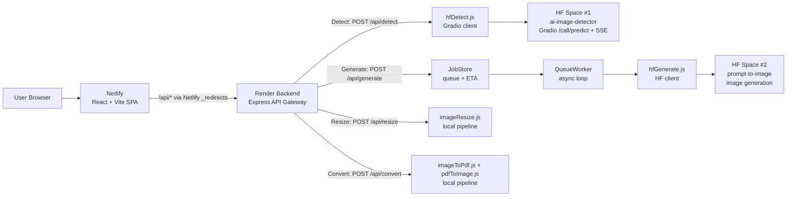
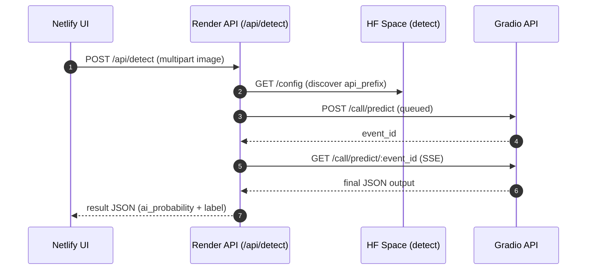
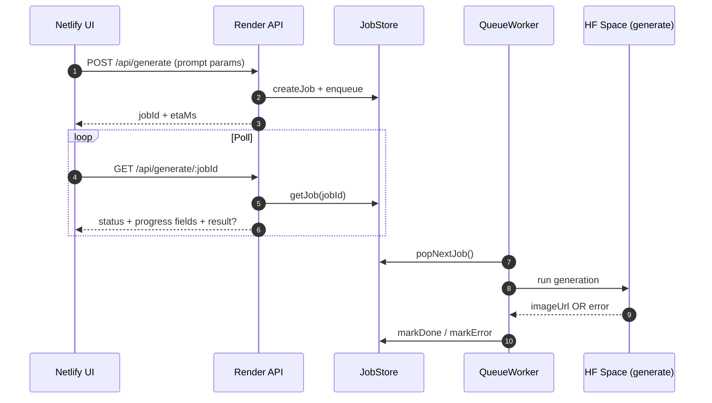

# Rivel Studio — AI Image Detector (Full-Stack)

A fully functional AI-integrated web application built to showcase engineering skills, distributed system design, and practical UX around real-world AI inference constraints (cold starts, queueing, variable latency). Built from scratch — no copied source code.

**Live**
- Frontend (Netlify): https://rivel-studio.netlify.app/
- Backend (Render): https://ai-image-detector-o6be.onrender.com/

---

## What this app does

A small suite of production-style tools:

- **Detect (AI vs Real)** — upload an image and receive AI probability + label  
- **Generate (Prompt → Image)** — job-based generation with progress UI (handles HF cold starts)  
- **Resize** — resize by dimensions / constraints  
- **Convert** — images ↔ PDF (PDF → images returned as ZIP)

---

## Why this project is “AI + Distributed Systems”

This system uses **Hugging Face Spaces** (free tier) for inference, where cold starts and queued execution are common.  
To keep UX reliable under real latency constraints, the backend acts as a lightweight **control plane** with caching, rate limiting, and async job orchestration.

---

## Architecture

---

## Core request flows

### Detect (Gradio queue + SSE)

### Generate (async jobs + polling)

---

## Roadmap (condensed)

**Phase 1 (Next ~3 months): Reliability**
- Redis-backed job queue (persistence + horizontal scaling)
- WebSocket progress updates (replace polling)
- Structured logging + request tracing
- Retries with exponential backoff
- Circuit breaker for HF failures
- Deep health checks (dependency-aware)

**Phase 2 (3–6 months): Features**
- Batch processing (multi-file requests)
- Stronger model options (SDXL / ControlNet / Img2Img workflows)
- Optional user accounts (history + quotas)
- Next.js migration (SSR + SEO)
- Public developer API (API keys + rate limits)

**Phase 3 (6–12 months): Microservices**
- Extract Detect/Generate/Resize/Convert into independent services
- Central API gateway (routing + auth)
- Container orchestration (Kubernetes)
- Event-driven messaging between services

---

## System design & architecture (what’s implemented)

**Implemented patterns**
- **Async job processing:** submit → jobId → status polling; worker handles long inference  
- **Rate limiting:** protects public endpoints and controls cost exposure  
- **TTL caching (detect):** speeds repeat requests and reduces HF calls (tradeoff: memory-only)  
- **Stateless API:** no sessions; state is job-based (Redis planned)  
- **Decoupled deployments:** Netlify UI + Render API deploy independently  
- **Separation of concerns:** Routes → Services → Utils → Middleware  

**Priority gaps (by value)**
- **High:** persistent queue/storage, observability, retry/backoff, circuit breaker  
- **Medium:** WebSockets, idempotency keys, dead-letter queue  
- **Low:** API versioning, stronger validation, security headers  

**Learning focus**  
This project intentionally explores production patterns (async queues, caching, rate limiting) beyond what’s strictly required—serving as a sandbox for backend architecture experimentation under real-world free-tier constraints.

---

## Deployment notes

**Frontend (Netlify)**
- Uses `_redirects` to proxy `/api/*` → Render backend

**Backend (Render)**
- Express API gateway orchestrates HF Spaces + local media pipelines  
- Secrets (HF tokens) must be stored in platform environment variables (never in Git)

---

## Security note

Never commit tokens (HF_TOKEN) to GitHub. Rotate tokens immediately if exposed and remove them from Git history.

---

## Credits

Designed and built by Sara Dubey —  (2026), Virginia, USA.
