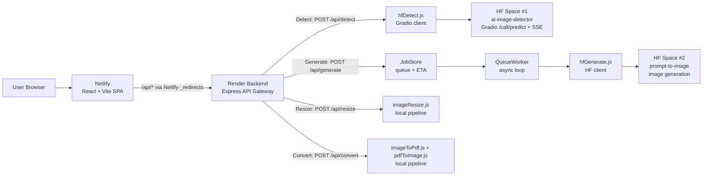
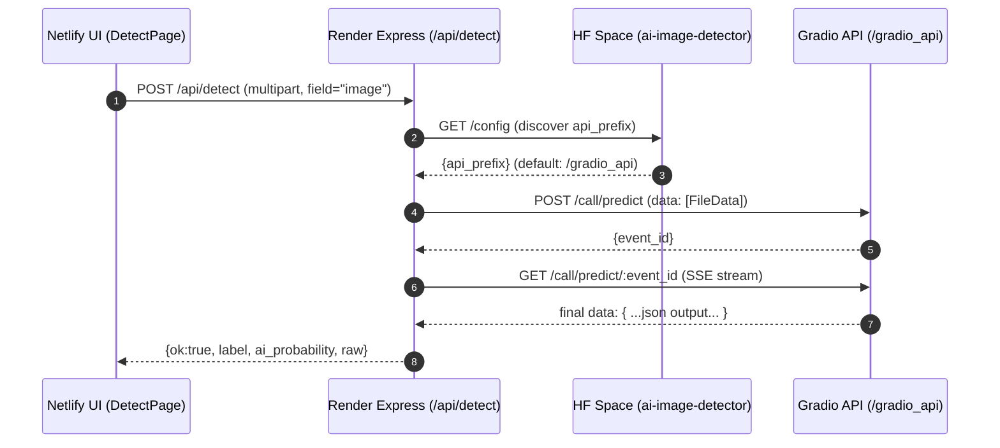
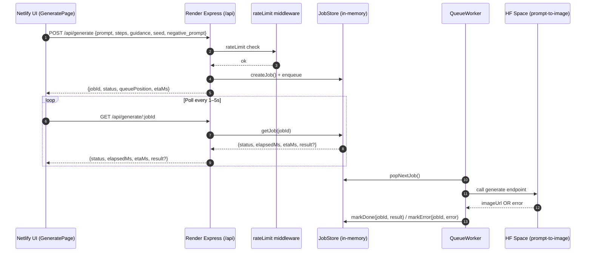

# Rivel Studio — AI Image Detector (Full-Stack)

A fully functional AI-integrated web application built to showcase engineering skills, distributed system design, and practical UX around real-world AI inference constraints (cold starts, queueing, variable latency). Built from scratch — no copied source code.

**Live**
- Frontend (Netlify): https://rivel-studio.netlify.app/
- Backend (Render): https://ai-image-detector-o6be.onrender.com/

---

## What this app does

Rivel Studio provides four production-style tools:

- **Detect (AI vs Real)** — Upload an image and get an AI probability + label.
- **Generate (Prompt → Image)** — Job-based image generation with polling/progress UI (handles HF cold starts).
- **Resize** — Resize by dimensions / constraints.
- **Convert** — Images ↔ PDF (PDF → Images returns ZIP).

---

## Why this project is “AI + Distributed Systems” (not just an API call)

This system uses **Hugging Face Spaces** (free tier) for inference. Free Spaces can:
- **sleep / cold start** (can take minutes to wake),
- run **queued inference** (variable latency),
- fail transiently due to load.

To deliver reliable UX anyway, the backend acts as a lightweight **control plane**:
- API gateway (Express)
- Rate limiting
- Caching
- Job queue + worker loop for long-running generation
- Polling endpoints so the UI can show progress and avoid request timeouts

---

## Architecture

### High-level system diagram



---

## Core request flows

### 1) Detect flow (Gradio queue + SSE)



---

### 2) Generate flow (Job queue + polling)



---

## Product/UX choices (built for real constraints)

- **Progress UX** for long-running generation (polling + status card)
- **Explicit warning** that HF free models can sleep and wake slowly
- **Rate limiting** to protect free inference backends from abuse
- **Caching** to reduce repeated calls and control latency/cost
- **Clear error surfacing** (no silent failures)

---

## Tech stack

**Frontend**
- React + Vite
- Netlify hosting
- Netlify `_redirects` proxies `/api/*` → backend

**Backend**
- Node.js + Express (Render)
- Multer uploads for images/PDFs
- Rate limiting middleware
- Simple in-memory cache + job store + queue worker

**AI / Inference**
- Hugging Face Spaces (Gradio API for Detect + generation)

---

## Local development

### Backend
```bash
cd backend
npm install
npm run dev
```

Create `backend/.env` (example — do not commit secrets):
```env
PORT=8080
CORS_ORIGIN=http://localhost:5173
HF_TOKEN=YOUR_TOKEN

SPACE_ID=saradubey6/ai-image-detector
GENERATE_SPACE_ID=saradubey6/prompt-to-image
GENERATE_ENDPOINT=/generate
```

### Frontend
```bash
cd frontend
npm install
npm run dev
```

---

## Deployment notes

### Backend (Render)
- Root directory: `backend`
- Build: `npm install`
- Start: `node src/server.js`
- Set env vars in Render dashboard (never commit tokens)

### Frontend (Netlify)
- Base directory: `frontend`
- Build: `npm run build`
- Publish: `dist`
- `frontend/public/_redirects`:
  ```
  /api/*  https://ai-image-detector-o6be.onrender.com/api/:splat  200
  /*      /index.html  200
  ```

---

## Security note

Never commit tokens (HF_TOKEN) to GitHub. Use:
- `.env` locally
- Render Environment Variables in production

If a token was committed, rotate it immediately in Hugging Face and remove it from Git history.

---

## Credits

Designed and built by Sara Dubey —  2026, Virginia, USA.
